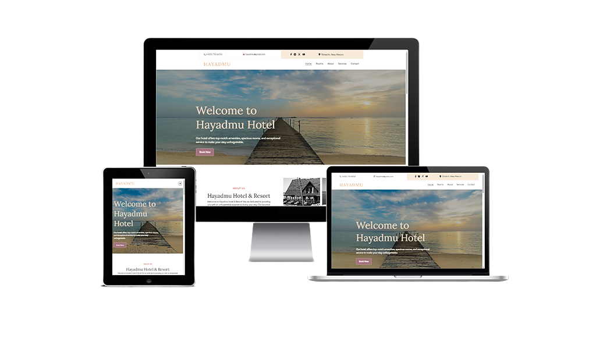

# Hotel Resort Project

  
[**Screenshots**](#screenshots) | [**Features**](#features) | [**Technologies**](#technologies) | [**Color Reference**](#color-reference) | [**Fonts**](#fonts) | [**Photos**](#photos) | [**What We learned**](#what-we-learned) | [**Demo**](#demo) | [**Contributions**](#contributions)

This repository contains all the code for our hotel website project. The project is developed using React, JavaScript, HTML, and CSS.

This web application is designed to provide users with detailed information about hotel rooms and services. Users can explore different room types, features, and prices, as well as learn about the amenities offered by the hotel.

In this project, our goal was to create a modern, user-friendly, and informative hotel website. We worked diligently to ensure that users have access to the most accurate and comprehensive information about our hotel.

## Screenshots

## Features

- **Comprehensive Room Information**: Users can access detailed information about the various room types and features offered by the hotel.
- **Services and Amenities**: Information about all the services and amenities provided by the hotel is available.
- **User-Friendly Interface**: With a modern and intuitive interface, users can easily find the information they are looking for.
- **Responsive Design**: The website is fully responsive to ensure the best experience on all devices.

## Technologies

- React : Used to provide flexibility and speed in developing the user interface.
- JavaScript : Used to add dynamic and interactive features.
- HTML & CSS : Used for structural and visual design.
- GIT : A version control system (GIT) was used for teamwork.

## Color Reference

| Color             | HEX         |
| ---------------- | --------------- |
| White         |  #ffffff |
| Black         |  #000000 |
| Albescent White      |  #f7ead9 |
| Tumbleweed         |  #dca77b |
| Pharlap         |  #a3727d |
| Contessa         |  #c27c74 |
| Shark         |  #212429 |
| Spun Pearl         |  #aaaab2 |

## Fonts
- <a href="https://fonts.google.com/specimen/Cabin" target="blank">Cabin</a>
- <a href="https://fonts.google.com/specimen/Lora" target="blank">Lora</a>
- <a href="https://fontawesome.com/" target="blank">Font Awesome Icons</a>

## Photos
- Unsplash
- Pexels

## What we learned

- UI Design and Styling: By experiencing the process of designing user interfaces using HTML and CSS, we learned how to efficiently apply styles.
- Responsive Design: By experiencing the process of designing the project to be responsive across different devices, we learned how to produce solutions to enhance user experience.
- React Fundamentals: By learning how React components are created, along with fundamental concepts such as props, state, component communication, and lifecycle management, we established a solid foundation for developing React projects.
- Basic JavaScript: While developing the project, we learned the basic structures of JavaScript, data types, functions, and fundamental programming concepts, experiencing how JavaScript can be utilized in real-world projects.
- Version Control (GIT): Throughout the project development, we learned to work collaboratively in different branches as a team, ensuring each work is done in an isolated manner. By merging different branches, we facilitated collaboration among team members and coordinated the project's development process.

  
## Demo

[https://hotel-resort-project.vercel.app/](https://hotel-resort-project.vercel.app/)

## Contributions

     

                  

